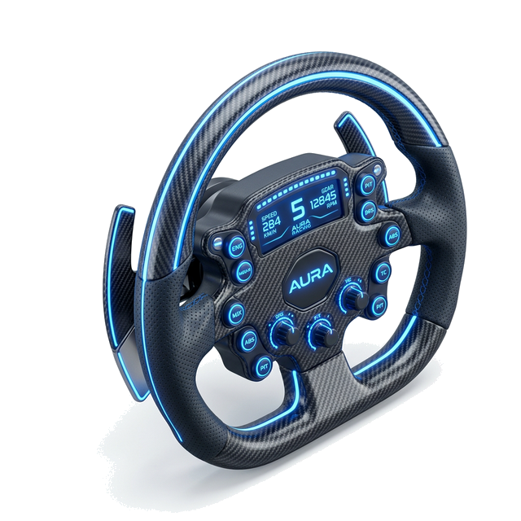
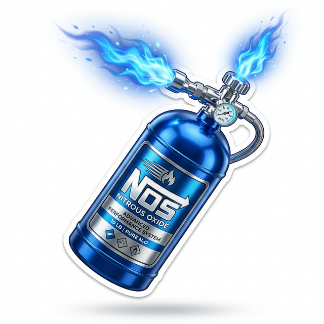
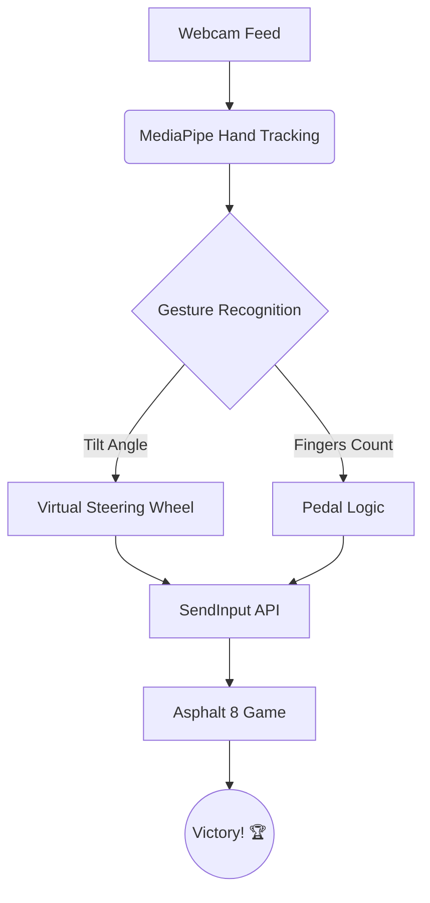

<p align="center">
  
</p>


# 🧤 Racing CV: Next-Gen Gesture Controller

<p align="center">
  
  
  
  
</p>

---

## 🚀 Overview

Experience **Asphalt 8** like never before. **Racing CV** transforms your webcam into a high-precision gesture input device. No controller? No problem. Use your hands to steer, drift, and blast through the competition with Nitro!

### ✨ What's New (v2.0)
- **Object-Oriented Refactor**: Clean, modular code for maximum performance.
- **Modern HUD**: Real-time steering wheel indicator and status bars.
- **Instructional Popup**: Intuitive setup guide before the race begins.
- **Low Latency**: Optimized hand tracking with MediaPipe.

---

## 🎮 Game Controls

| Action | Gesture | Icon |
| :--- | :--- | :---: |
| **STEER** | Rotate hands at 9 & 3 o'clock |  |
| **ACCELERATE** | Both palms wide open (🖐️ 🖐️) | 💨 |
| **BRAKE/DRIFT** | Both hands as fists (✊ ✊) | 🛑 |
| **NITRO** | Thumb up gesture (👍) |  |

---

## 🛠️ Installation

1. **Clone the Repo**
   ```bash
   git clone https://github.com/SubashSK777/Racing-CV.git
   cd Racing-CV/Asphalt 8
   ```

2. **Install Dependencies**
   ```bash
   pip install -r requirement.txt
   ```

3. **Ignite the Engine**
   ```bash
   python main.py
   ```

---

## 🧠 How it Works



---

## 🌟 Visual HUD

The all-new **Modern HUD** provides real-time feedback:
- **Steering Wheel**: Rotates as you tilt your hands.
- **Power Bars**: Visual confirmation for Accel/Brake/Nitro.
- **Safety**: "Show Both Hands" warning when lost.

---

## 🤝 Contributing

Got ideas to make it faster? 🏎️💨
Feel free to fork, star, and submit an issue or PR!

## 📜 License
This project is licensed under the **GPL License**.

---

<p align="center">
  MADE WITH ❤️ FOR RACERS
</p>
